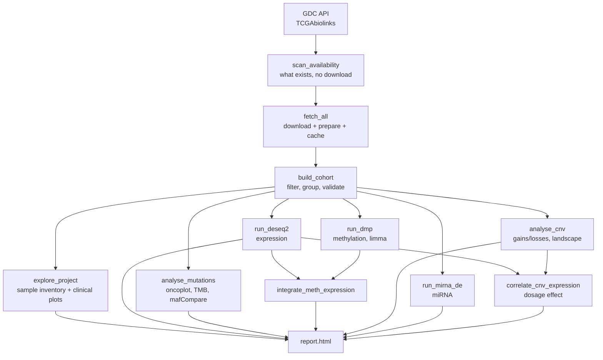

# TCGA Multi-Omics Differential Analysis Framework

A reproducible, config-driven pipeline for querying [TCGA](https://portal.gdc.cancer.gov/) through the GDC API, caching harmonised multi-omics data locally, and running differential analyses across any two groups you can define — gene expression (DESeq2), somatic mutations (maftools), DNA methylation (limma), copy number, and miRNA.


```bash
make conda-env && conda activate tcga-omics        # all dependencies, one command
make scan PROJECT=TCGA-BRCA                        # what data exists?
make run CONFIG=config/brca_tumor_vs_normal.yml    # cohort -> DE -> mutations -> report
```

---

## Why this exists

Most TCGA analyses are re-written from scratch every time, as a notebook that downloads a few gigabytes, hardcodes one contrast, and cannot be re-run six months later. This framework separates the three things that should be separate:

| Concern | Where it lives | Consequence |
|---|---|---|
| **What data to get** | `R/gdc_query.R` | GDC workflow labels change; one file to update |
| **Which samples to compare** | YAML config | a new contrast is a new config, not new code |
| **How to test** | `R/de_rnaseq.R`, `R/mutations.R`, `R/methylation.R` | statistics reviewed once, reused everywhere |

Data is downloaded **once** into `cache/<PROJECT>/` as prepared Bioconductor objects. Every subsequent contrast on that tumour type is instant.

---

## Pipeline



The cohort is defined **once** and applied to every layer, so the expression, mutation and methylation results always describe the same patients.

---

## Quickstart

### 1. Install

```bash
git clone https://github.com/GiovanniLembo/tcga-omics-framework.git
cd tcga-omics-framework
```

**Conda (recommended).** Pulls R, Bioconductor and every system library in one step:

```bash
conda env create -f environment.yml     # or: mamba env create -f environment.yml
conda activate tcga-omics
```

`mamba` is strongly preferred — plain conda can spend a long time solving the Bioconductor dependency graph. `make conda-env` uses mamba automatically when it is on your PATH and falls back to conda when it is not.

**Existing R install.** If you already have R ≥ 4.3 and Bioconductor ≥ 3.18:

```bash
Rscript install/install_dependencies.R          # add --optional for enrichment
```

**Docker**, if you would rather not touch either:

```bash
docker build -t tcga-omics .
docker run --rm -v "$PWD":/work -w /work tcga-omics \
    Rscript scripts/02_run_analysis.R --config config/brca_tumor_vs_normal.yml
```

### 2. Look before you download

```bash
Rscript scripts/00_explore_projects.R --list                  # all 33 TCGA projects
Rscript scripts/00_explore_projects.R --project TCGA-BRCA     # inventory one
```

This queries the GDC without downloading any assay data, and writes:

- `omics_availability.tsv` — samples and patients per layer and sample type
- `01_sample_availability.png` — how many tumours, how many adjacent normals, per layer
- `02_multiomic_overlap.png` — how many patients have RNA-seq **and** mutations **and** methylation
- **`available_contrasts.tsv`** — every clinical and molecular-subtype field you can use as `cohort.group_by`, one row per level, with sample/patient counts on each side. This is the table you read to fill in a config — no more guessing column names or spellings. Comes from the clinical + subtype download only (fast, no assay data); skip it with `--no-clinical` for the old availability-only scan.
- `03_clinical_*.png` — distribution of each of those fields

The multi-omic overlap figure is what decides whether a multi-omic contrast is even feasible before you spend an afternoon downloading; `available_contrasts.tsv` is what decides which contrast to run.

Only `TCGA-*` project ids are supported end-to-end (tumour/normal calls rely on the TCGA barcode format). `--list --all-programs` also lists the other GDC programs (TARGET, CPTAC, MMRF, ...) for reference.

### 3. Define a contrast

```yaml
project: TCGA-BRCA

omics:
  rnaseq: true
  mutation: true
  methylation: false

cohort:
  group_by: tissue_class    # from the barcode: tumor / normal / control
  treatment: tumor          # numerator: positive log2FC = higher in tumour
  reference: normal         # denominator
  paired: false             # true = only patients with both, blocked on patient

deseq2:
  assay: unstranded         # raw integer counts
  min_count: 10
  protein_coding_only: true
  alpha: 0.05
  lfc_threshold: 1
  shrink: true
```

Any column of the sample annotation can be the grouping variable — clinical fields are prefixed `clin_`, curated molecular subtypes `subtype_`:

```yaml
cohort:
  group_by: subtype_BRCA_Subtype_PAM50
  treatment: Basal
  reference: LumA
  filters:
    tissue_class: [tumor]
```

### 4. Run

```bash
Rscript scripts/02_run_analysis.R --config config/brca_tumor_vs_normal.yml
Rscript scripts/02_run_analysis.R --config config/luad_stage_i_vs_iv.yml --only rnaseq
```

Or skip the YAML entirely for exploratory work, including across several tumour types at once:

```bash
Rscript scripts/03_quick_contrast.R --projects TCGA-BRCA,TCGA-LUAD,TCGA-KIRC
```

---

## What a run produces

```
results/tcga_brca_tumor_vs_normal/
├── report.html                        # everything below, in one page
├── run_config.resolved.yml            # every parameter actually used
├── sessionInfo.txt                    # every package version actually loaded
├── figures/
│   ├── 01_sample_availability.png     05_… clinical distributions
│   ├── 10_pca.png                     11_sample_distance.png
│   ├── 12_volcano.png                 13_ma_plot.png
│   ├── 14_pvalue_histogram.png        15_top_genes_heatmap.png
│   ├── 20_oncoplot.png                21_tmb_by_group.png
│   ├── 23_forest_plot.png             24_cooncoplot.png
│   ├── 30_dmp_volcano.png             31_dmp_heatmap.png
│   ├── 32_meth_vs_expression.png
│   ├── 40_mirna_volcano.png           42_mirna_pca.png
│   ├── 50_cnv_landscape.png           51_cnv_top_genes.png
│   └── 52_cnv_expression_correlation.png
└── tables/
    ├── cohort_summary.tsv             sample_annotation.tsv
    ├── deseq2_results_all.tsv         deseq2_results_significant.tsv
    ├── mutation_gene_summary.tsv      mutation_group_comparison.tsv
    ├── tumor_mutational_burden.tsv
    ├── dmp_results_significant.tsv
    ├── methylation_expression_integration.tsv
    ├── mirna_results_significant.tsv
    ├── cnv_alteration_frequency.tsv   cnv_group_comparison.tsv
    └── cnv_expression_correlation.tsv
```

`run_config.resolved.yml` + `sessionInfo.txt` are what make a result defensible months later: the exact parameters and the exact package versions, written next to the figures they produced.

---

## Design decisions worth knowing

These are the details that quietly break TCGA analyses, and how the framework handles them.

**Raw counts, not TPM.** GDC's STAR output ships six assays in one object. Only `unstranded` holds raw integer counts; `tpm_unstrand` and `fpkm_unstrand` are already normalised and are statistically invalid input for DESeq2's negative-binomial model. The config makes the choice explicit and `make_dds()` refuses an assay that is not present.

**Replicate aliquots are removed.** Some samples ship several aliquots (different vial, portion or plate) that share a 15-character sample barcode. Keeping them inflates group sizes and violates independence. `dedup_aliquots()` keeps one aliquot per sample and reports how many it dropped.

**Tumour/normal comes from the barcode, not a clinical column.** Characters 14–15 of the TCGA barcode encode the sample type (`01` primary tumour, `11` solid tissue normal, `06` metastatic, …). That is authoritative; clinical tables are patient-level and cannot distinguish a tumour from its matched normal.

**Mutation contrasts must be tumour vs tumour.** TCGA somatic MAFs are tumour-only calls — the matched normal is used as a filter and never appears as a sample. A "tumour vs normal" mutation comparison is therefore meaningless, and the BRCA example config sets `compare_groups: false` for exactly that reason. Subtype or stage contrasts are the meaningful ones.

**M-values for testing, delta-beta for reporting.** Beta values are bounded in [0,1] and heteroscedastic, which breaks the linear model limma fits. Tests run on M-values; effect sizes are reported as Δβ because that is the interpretable scale.

**Paired designs are offered, not assumed.** With `paired: true` the framework keeps only patients carrying both groups and blocks on patient (`~ patient + cohort_group`). This removes inter-patient variability and is usually far more powerful for tumour vs adjacent-normal, at the cost of a much smaller n.

**Batch correction is opt-in, not automatic — and confounding is checked whenever you use it.** TCGA samples were collected across many institutions (Tissue Source Site) and plates, which is a documented source of non-biological variation. `tss`/`plate`/`center` are parsed from every barcode for free and can be added as a covariate (`covariates: [tss]`) to RNA-seq, miRNA or methylation; `auto_sva` estimates hidden batch structure directly from the data when you don't have a clean label for it. Every covariate — named or inferred — is checked for confounding with the contrast first and dropped with a warning if a batch level exists on only one side, because a blind correction there would just remove the biological signal along with the batch. See [Batch correction](docs/config_reference.md#batch-correction).

**Copy-number calls are ploidy-corrected.** ASCAT3 reports absolute copy number, so calling "gain" at CN ≥ 3 is wrong in a near-tetraploid tumour, where 3 copies is a relative *loss*. `discretise_cnv()` estimates each sample's ploidy as the median copy number across genes and calls gains and losses as a ratio to it. Homozygous deletion (CN = 0) is the one absolute call.

**The p-value histogram is always plotted.** A flat distribution with a spike near zero means the model is sane. Anything else — a slope, a hump near 1 — means it is misspecified, and no amount of downstream enrichment will rescue it. It is generated on every run so it cannot be skipped.

---

## Repository layout

```
R/                    # the framework
├── utils.R           # logging, barcode parsing, aliquot de-duplication
├── config.R          # YAML loading, validation, run snapshots
├── gdc_query.R       # GDC query definitions + availability scanning
├── download.R        # download, prepare, cache
├── cohort.R          # filtering, grouping, pairing, validation
├── explore.R         # inventory + clinical figures
├── de_rnaseq.R       # DESeq2 + QC + result figures
├── mutations.R       # maftools: oncoplot, TMB, mafCompare
├── methylation.R     # limma DMPs + expression integration
├── cnv.R             # ploidy-aware gain/loss calling + dosage analysis
├── mirna.R           # miRNA reshaping + DESeq2
└── report.R          # dependency-free HTML report

scripts/              # CLI entry points (optparse)
config/               # example contrasts, documented inline
environment.yml       # conda environment (all dependencies)
docs/                 # getting started, config reference, FAQ
install/              # dependency installer
```

---

## Omics layers

| Layer | Config key | Statistics | Main outputs |
|---|---|---|---|
| Gene expression | `rnaseq` | DESeq2 negative binomial | volcano, MA, PCA, heatmap, GO enrichment |
| Somatic mutations | `mutation` | Fisher (`mafCompare`) | oncoplot, TMB, forest plot, co-oncoplot |
| DNA methylation | `methylation` | limma on M-values | DMP volcano, heatmap, Δβ tables |
| Copy number | `cnv` | Fisher per gene | genome-wide landscape, top altered genes, dosage effect |
| miRNA | `mirna` | DESeq2 | volcano, MA, PCA, top miRNA boxplots |

All five share the same cohort definition, so a single config drives every layer.

## Extending it

Adding a layer is one entry in `OMIC_SPECS` (`R/gdc_query.R`) plus an analysis function that takes `(cohort, cfg)`. Protein expression (RPPA) and clinical survival modelling are the obvious next ones.

---

## Documentation

- [Getting started](docs/getting_started.md) — first run, walked through end to end
- [Config reference](docs/config_reference.md) — every option, with defaults
- [FAQ and troubleshooting](docs/faq.md) — GDC timeouts, memory, common errors

## Citation

If this helps your work, please cite the underlying tools: TCGAbiolinks (Colaprico *et al.*, 2016), DESeq2 (Love *et al.*, 2014), maftools (Mayakonda *et al.*, 2018), limma (Ritchie *et al.*, 2015).

## License

MIT — see [LICENSE](LICENSE).
